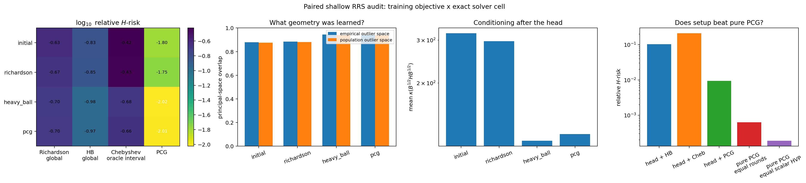
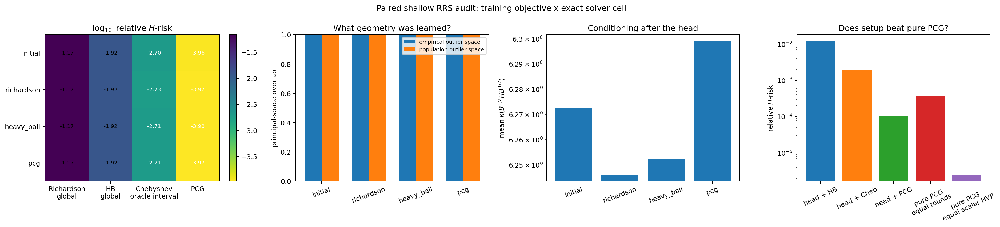

# Audit causal : quel solveur apprend quel sous-espace ?

## Conclusion

La tête apprend bien une covariance inverse de faible rang, mais le choix du
solveur ne doit pas être confondu avec le choix de la géométrie.

- Sans étape spectrale hardcodée, l'objectif Heavy--Ball apprend un bien
  meilleur sous-espace que Richardson : le recouvrement avec les deux
  outliers passe de `0.878` à `0.945` et le conditionnement effectif de
  `320.1` à `115.7`.
- Une seule étape de puissance en bloc, exacte et matrix-free, porte déjà le
  recouvrement à `0.9998` et le conditionnement à environ `6.25`. Les trois
  objectifs d'entraînement deviennent alors presque indistinguables : cette
  relation doit être hardcodée, pas réapprise.
- À profondeur quatre, Heavy--Ball est le meilleur contrôleur stationnaire
  bouclé, mais il ne bat ni Chebyshev ni PCG. La meilleure méthode en erreur
  est la tête suivie de PCG.
- La tête + PCG-4 bat PCG pur à nombre égal de **rounds HVP en bloc** d'un
  facteur `3.43`, mais perd d'un facteur `42.9` si les trois directions sont
  facturées comme des HVP scalaires séquentiels. Le gain est donc un gain de
  latence parallèle GPU, pas un gain universel de FLOPs CPU.

Ces résultats excluent la revendication « Heavy--Ball bat tous les solveurs ».
Ils valident une revendication plus précise : Heavy--Ball fournit le meilleur
compromis de cellule stationnaire exacte et entraîne une géométrie utile,
tandis que PCG reste la meilleure cellule de consommation lorsque l'algèbre de
Krylov explicite est autorisée.

## Protocole apparié

Chaque tâche est un problème inverse latent de dimension `K=12`. Sa covariance
de population possède deux outliers spectraux de force `100`, mais leur
sous-espace est tourné indépendamment par une matrice de Haar à chaque prompt.
Une covariance globale apprise dans les poids est donc isotrope en moyenne et
ne peut pas mémoriser ces directions.

Les trois modèles :

1. commencent avec exactement les mêmes poids de tête ;
2. voient les mêmes minibatches dans le même ordre ;
3. utilisent trois seeds, `1000` pas et la même perte relative dans la norme
   postérieure (H) ;
4. diffèrent uniquement par la cellule exacte Richardson, Heavy--Ball ou PCG ;
5. sont ensuite croisés avec toutes les cellules d'évaluation.

La tête est une seule tête softmax équivariante sur les équations. Elle route
un bloc (Y_\theta\in\mathbb R^{K\times S}). QR, HVP, Ritz, application du
préconditionneur et transitions du solveur sont entièrement hardcodés. Aucun
spectre exact n'est donné au réseau ; les eigendecompositions complètes ne sont
utilisées qu'après inférence pour les diagnostics et les contrôles oracle.

Le script reproductible est
[`audit_rotated_low_rank_controller_learning.py`](audit_rotated_low_rank_controller_learning.py).

## Pourquoi la nouvelle normalisation est nécessaire

La certification initiale utilisait seulement

\[
  \lambda_{\max}(H)\leq\operatorname{tr}H.
\]

Elle reste vraie après déflation, mais devient très lâche précisément quand la
tête a supprimé les outliers. Elle forçait donc le pas HB à être beaucoup trop
petit.

Posons (A=H/s_H), avec \(\operatorname{tr}A=\bar L\), et écrivons dans la
base ([U,U_\perp])

\[
 A=\begin{bmatrix}C&R^\top\\R&D\end{bmatrix}.
\]

La correction Ritz (M=c_\star C^{-1}) transforme exactement le bloc choisi
en (c_\star I). Sans former (H), on connaît

\[
 d=\operatorname{tr}A-\operatorname{tr}C,
 \qquad
 \gamma=\|RM^{1/2}\|_F.
\]

Par positivité, \(\lambda_{\max}(D)\le d\), donc

\[
 \lambda_{\max}(\widetilde B^{1/2}A\widetilde B^{1/2})
 \le
 \widehat L
 :=\frac{c_\star+d+
 \sqrt{(c_\star-d)^2+4\gamma^2}}{2}.
\]

Le rescaling final par \(\widehat L/\bar L\) sature une borne déterministe
beaucoup plus serrée. Il ne demande que le Ritz (S\times S), le résidu déjà
calculé et une trace. Les tests vérifient simultanément la formule, la
covariance de jauge, l'absence de matrice normale dans le décodeur matrix-free
et la borne finale.

## Résultat 1 : routage appris pur, aucune étape de puissance

Moyennes sur trois seeds et 4096 tâches nouvelles par seed :

| tête entraînée avec | recouvrement outliers | conditionnement | risque avec Richardson | risque avec HB | risque avec PCG |
|---|---:|---:|---:|---:|---:|
| initiale | 0.8783 | 320.09 | 0.2336 | 0.1476 | 0.01598 |
| Richardson | 0.8845 | 297.31 | 0.2151 | 0.1406 | 0.01763 |
| Heavy--Ball | **0.9446** | **115.67** | **0.1989** | **0.1036** | **0.00945** |
| PCG | 0.9412 | 123.25 | 0.2018 | 0.1066 | 0.00978 |

Ici l'objectif HB apprend réellement quelque chose : avec la même cellule HB,
sa tête réduit le risque de `29.8 %` face à la tête initiale. Appliquée ensuite
à PCG, elle réduit aussi le risque de `40.8 %`. Richardson donne un signal de
géométrie beaucoup plus faible.

Ce régime n'est toutefois pas compétitif en coût total : PCG pur à cinq HVP
atteint `6.31e-4`, contre `9.45e-3` pour tête-HB + PCG-4. Une approximation
low-rank imparfaite peut réduire le conditionnement tout en détruisant les
quelques clusters que CG exploitait déjà efficacement. Le conditionnement seul
n'est donc pas une théorie suffisante pour PCG.

## Résultat 2 : une étape de puissance en bloc hardcodée

| tête entraînée avec | recouvrement outliers | conditionnement | risque Richardson-4 | risque HB-4 | risque Cheb-4 | risque PCG-4 |
|---|---:|---:|---:|---:|---:|---:|
| initiale | 0.99974 | 6.272 | 0.06785 | 0.01210 | 0.002014 | 1.092e-4 |
| Richardson | 0.99984 | **6.246** | 0.06745 | 0.01197 | **0.001876** | 1.081e-4 |
| Heavy--Ball | 0.99982 | 6.252 | **0.06732** | **0.01195** | 0.001972 | **1.059e-4** |
| PCG | 0.99981 | 6.299 | 0.06830 | 0.01205 | 0.001954 | 1.078e-4 |

Les écarts de tête sont maintenant minuscules : la bonne décision
first-principles est de conserver cette unique étape linéaire hardcodée.
L'ordre des cellules à profondeur quatre est sans ambiguïté :

\[
  \text{PCG }(1.06\,10^{-4})
  < \text{Chebyshev }(1.97\,10^{-3})
  < \text{HB }(1.19\,10^{-2})
  < \text{Richardson }(6.73\,10^{-2}).
\]

Le coût de tête vaut deux rounds HVP en bloc, soit six HVP scalaires si les
trois slots sont exécutés séquentiellement. Ainsi :

| méthode | comptage | risque (H) |
|---|---|---:|
| tête + HB-4 | 6 rounds en bloc | 1.195e-2 |
| tête + Cheb-4 | 6 rounds en bloc | 1.972e-3 |
| tête + PCG-4 | 6 rounds en bloc | **1.059e-4** |
| PCG pur | 6 HVP / rounds | 3.694e-4 |
| PCG pur | 10 HVP scalaires | **2.515e-6** |

## Validation de la théorie d'optimisation

Pour Richardson et HB, la prédiction est calculée à partir du polynôme de
résidu exact

\[
 p_{-1}(\lambda)=p_0(\lambda)=1,
 \qquad
 p_{t+1}(\lambda)
 =(1+\beta-\alpha\lambda)p_t(\lambda)-\beta p_{t-1}(\lambda),
\]

et de la mesure spectrale pondérée par le second membre. Dans le régime
principal (r=1), l'écart absolu moyen maximal entre risque prédit et risque
réalisé vaut `3.36e-7`. Cela valide la partie optimisation de la théorie
conjointe sans approximation par MLP.

Le contrôle « HB oracle d'intervalle » montre aussi une subtilité importante :
les paramètres asymptotiques de Polyak peuvent avoir un fort transitoire à
très petite profondeur. Les deux scalaires HB entraînés directement sur le
risque fini sont alors préférables. Chebyshev demeure le meilleur polynôme
minimax d'intervalle à horizon fixé.

## Décision architecturale

La sélection finale dépend du sens exact de « Transformer pur » :

- **Cellule bouclée, stationnaire, algèbre minimale :** Heavy--Ball. Deux
  scalaires partagés, un token mémoire et aucune division adaptative.
- **Meilleur polynôme à horizon fixé :** Chebyshev. Un petit contrôleur peut
  prédire une mesure ou un intervalle, mais le calendrier et Clenshaw restent
  exacts ; le MLP n'émule aucune multiplication du solveur.
- **Meilleure précision shallow :** tête contextuelle + PCG explicite. C'est
  la seule variante qui bat ici PCG pur au comptage de latence en rounds.

La contribution apprise commune est donc

\[
 \mathcal C\longmapsto
 U_\theta(\mathcal C)\longmapsto
 B_\theta(\mathcal C)\approx H_\mathcal C^{-1},
\]

c'est-à-dire une covariance postérieure low-rank spécifique au prompt. Le
solveur exact qui la consomme peut être changé sans réentraîner la géométrie.
