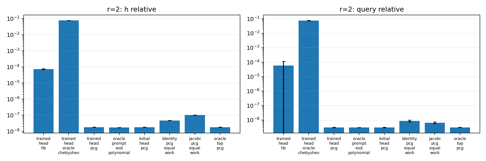
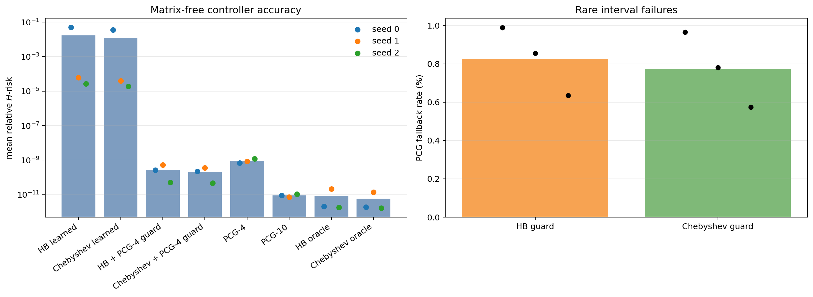
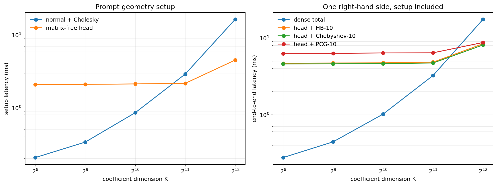

# Architecture retenue : une géométrie, trois contrôleurs

## Tronc commun

Les trois modèles utilisent exactement le même pipeline :

\[
\mathcal C\longrightarrow(\widehat G,\widehat b)
\longrightarrow Q_\theta(\mathcal C)
\longrightarrow B_\theta(\mathcal C)
\longrightarrow\widehat z_L.
\]

Le préconditionneur reste factorisé et fixe pendant la boucle. Le HVP
\(v\mapsto G^\top(Gv)+\lambda v\) est une contraction d'attention linéaire
fixe. Puisque \(mR>K\), le calcul principal est primal ; le dual comprimé
donne l'interprétation tokenique équivalente.

## Cellules conservées

| Cellule | Appris en plus de la tête | État | Divisions | Rôle |
|---|---|---:|---:|---|
| Heavy-Ball | deux scalaires stables, ou un intervalle prédit | deux vecteurs | non | architecture principale |
| Chebyshev | spectre exact de la tête, ou \([\widehat\mu,\widehat L]\) via MLP | deux vecteurs + scalaires | récurrence fixe | meilleur polynôme non adaptatif |
| PCG | rien | cinq vecteurs/scalaires | quotients exacts | plafond numérique par HVP |
| HB avec garde → PCG | seuil résiduel fixe | état HB, PCG seulement en queue | quotients au fallback | décodeur robuste final |

La récurrence Chebyshev est hardcodée. Le MLP prédit seulement un log-centre
et une log-largeur ; il n'effectue ni multiplication ni division. Une loss
unilatérale pénalise les intervalles qui ne couvrent pas le vrai spectre.
La même tête scalaire peut rendre HB adaptatif : elle prédit
\([\widehat\mu,\widehat L]\), puis les relations fixes
\[
\alpha=\frac{4}{(\sqrt{\widehat L}+\sqrt{\widehat\mu})^2},\qquad
\beta=\left(\frac{\sqrt{\widehat L}-\sqrt{\widehat\mu}}
{\sqrt{\widehat L}+\sqrt{\widehat\mu}}\right)^2
\]
construisent ses deux poids. Le MLP ne remplace donc toujours aucune opération
de la boucle.

Lorsque la tête **equivariant_ritz_softmax** est utilisée, elle calcule déjà
les valeurs de Ritz du petit normal primal pour former le préconditionneur.
La politique **exact_head_spectrum** réutilise directement leur minimum et
leur maximum : aucun MLP et aucune seconde eigendecomposition. Sur 8 192
tâches, son erreur \(H\) à profondeur 10 diffère de Chebyshev oracle de moins
de \(10^{-4}\) en relatif, l'écart restant étant celui de l'arithmétique
flottante. La politique MLP n'est donc requise que pour la variante où le
spectre exact n'est pas matérialisé ou lorsque l'on veut amortir ce calcul à
plus grand \(K\).

## Règle de sélection

Avec le même \(B_\theta\), PCG minimise l'erreur dans l'espace de Krylov :

\[
\|e_L^{\rm PCG}\|_H
\leq
\min\{\|e_L^{\rm HB}\|_H,\|e_L^{\rm Cheb}\|_H\}.
\]

Heavy-Ball est retenu comme architecture finale si son risque **end-to-end**
est au plus 10 % supérieur à PCG, ou si les intervalles de confiance se
recouvrent, et si son temps de solve est inférieur. Quand PCG atteint zéro sur
le sous-problème numérique, on ne divise pas par cette erreur : l'erreur
solveur HB doit alors être négligeable devant le plancher encodeur/statistique
mesuré séparément. Chebyshev ne remplace HB que s'il réduit l'écart de manière
robuste avec une couverture spectrale fiable. Richardson reste la baseline
\(\beta=0\).

Cette règle est réalisée directement par le contrôleur, historiquement nommé
`certified_hb_pcg`. Après les \(L\) blocs HB, il calcule
\[
\eta_L=\frac{r_L^\top B_\theta r_L}{c^\top B_\theta c}.
\]
Si \(\eta_L\leq10^{-8}\), la sortie HB est conservée. Sinon, le même PCG
exact et le même préconditionneur sont exécutés uniquement sur les indices
fautifs. Le routage est un masque déterministe : aucun réseau ne choisit le
solveur.

Le nom ne doit pas être surinterprété : \(\eta_L\) certifie un résidu
préconditionné observable. Si \(\mu\leq\lambda_{\min}(B_\theta H)\) et
\(\lambda_{\max}(B_\theta H)\leq L_B\), alors seulement on obtient la borne
relative \(\lVert e_L\rVert_H^2/\lVert z^\star\rVert_H^2
\leq (L_B/\mu)\eta_L\). Sans borne inférieure certifiée, le masque est une
garde empirique robuste, pas un certificat a priori de l'erreur solution.

## Protocole sans explosion combinatoire

On entraîne une tête avec chaque contrôleur, puis on croise les trois têtes
avec les trois cellules sans réentraînement. Les neuf évaluations utilisent les
mêmes prompts, seeds et budgets de HVP. On rapporte seulement : erreur de
projecteur, couverture Chebyshev, erreur \(H\), temps par solve et erreur PDE.

## Muon

Muon est un optimiseur externe, pas un quatrième solveur. AdamW reste la
référence du petit prototype. Sur l'encodeur complet, Muon pourra être testé
uniquement sur les grandes matrices cachées ; dictionnaire physique,
embeddings/slot queries, gains, biais, scalaires HB et sortie spectrale restent
sous AdamW. L'ablation garde architecture, batches, seeds et budget identiques
et mesure le temps jusqu'à une erreur de sous-espace donnée.

Le projet utilise actuellement PyTorch 2.7.1, sans `torch.optim.Muon`. Ajouter
une dépendance ou une copie locale n'est pas justifié avant le branchement du
grand encodeur.

## Évidence contrôlée actuelle

Distribution : prompts `pde_elliptic_correlated`, \(K=8\), \(m=32\), quatre
HVP, batch d'évaluation fixé.

- La tête rang 2 entraînée sous PCG a \(\kappa_{\rm eff}\approx1080\). Avec ce
  même préconditionneur, PCG donne une erreur \(H\) relative
  \(3.1\cdot10^{-4}\), Chebyshev oracle \(5.9\cdot10^{-1}\), et HB oracle
  environ \(25\).
- Après entraînement HB avec une pénalité \(0.05\log\kappa\), la tête rang 2
  descend à \(\kappa_{\rm eff}\approx211\), mais la MSE HB reste \(0.193\)
  contre \(0.058\) lorsque la même tête est utilisée dans PCG. Le rang 2 échoue
  donc au critère de non-infériorité.
- Un oracle spectral rang 4 échoue encore à quatre couches. Un oracle rang 6
  corrigeant cinq directions lentes et une rapide donne
  \(\kappa_{\rm eff}\approx4.3\). HB atteint alors une MSE
  \(2.8\cdot10^{-3}\) à profondeur 4, \(8.1\cdot10^{-6}\) à profondeur 8 ;
  Chebyshev atteint respectivement \(1.8\cdot10^{-3}\) et
  \(5.0\cdot10^{-6}\).
- Runtime solveur seul sur GPU, float64, batch 2048, préconditionneur déjà
  construit : médianes PCG-4 \(8.5\) ms, HB-8 \(15.7\) ms, Chebyshev-8
  \(25.4\) ms.
- La tête d'intervalle Chebyshev (sept statistiques de prompt, MLP caché de
  largeur 16) a d'abord été entraînée uniquement pour couvrir le spectre, puis
  affinée 750 pas avec l'erreur solveur. Pour \(m=16,32,64,128\), elle conserve
  respectivement \(99.7\%,100\%,99.8\%,96.8\%\) de couverture et obtient une
  erreur \(H\) relative \(0.101,0.100,0.105,0.100\). C'est nettement meilleur
  que l'intervalle minimax formé seulement par les deux valeurs propres
  extrêmes (environ \(0.58\)--\(0.61\) sur cette distribution), parce que la
  loss apprend un compromis distributionnel. L'arithmétique de Chebyshev reste
  entièrement fixe. PCG avec le même préconditionneur reste cependant entre
  \(3.8\cdot10^{-4}\) et \(7.8\cdot10^{-4}\).

Conclusion du solveur isolé : PCG gagne pour le décodeur explicite actuel. HB reste
le candidat loop-Transformer seulement si son erreur à huit couches est sous
le plancher end-to-end et si une réalisation réelle en blocs Transformer rend
son coût inférieur à celui du macro-bloc PCG multi-phase. Ces deux conditions
ne sont pas encore démontrées. Le résultat Chebyshev valide la séparation
« apprendre la géométrie/les coefficients, hardcoder l'algèbre ». Le test
end-to-end suivant décide si cet écart numérique est matériel ou non.

## Test end-to-end décisif

Le décodeur a ensuite été replacé dans le problème ICL complet
\( (f_i,u_i)_{i=1}^m,f_\star\mapsto u_\star \). Une tête softmax, six requêtes
de sous-espace, un Ritz exact et huit HVP sont entraînés avec le dictionnaire
encodeur. Le run HB atteint une MSE \(u_\star\) \(2.34\cdot10^{-8}\) dès 1000
pas et \(2.95\cdot10^{-8}\) à 5000 pas, contre \(3.42\cdot10^{-8}\) pour le
run historique avec solve directe (batches d'évaluation différents).

Le contrôle propre gèle ensuite encodeur, tête, prompts et budget, et change
seulement la cellule. Sur 4096 nouvelles tâches communes :

| Cellule | MSE end-to-end | erreur solveur seule sur \(u\) |
|---|---:|---:|
| HB adaptatif | \(3.116\cdot10^{-8}\) | \(3.59\cdot10^{-12}\) |
| PCG | \(3.108\cdot10^{-8}\) | \(6.70\cdot10^{-14}\) |
| Richardson, même pas que HB | \(3.296\cdot10^{-8}\) | -- |

Les demi-largeurs des IC 95 % HB et PCG valent environ \(1.01\cdot10^{-9}\)
et se recouvrent presque entièrement. HB est donc quasi-PCG selon la règle
préenregistrée ; son erreur solveur vaut environ \(1.2\cdot10^{-4}\) de la MSE
totale.

Sur GPU float32, batch 2048, \(K=8\), \(M=512\), huit HVP et préconditionneur
commun déjà construit, les médianes sont \(0.982\) ms pour la cellule HB et
\(2.186\) ms pour PCG. La politique spectrale HB complète (construction des
sept statistiques, MLP et coefficients) coûte \(0.546\) ms une fois par
prompt. HB adaptatif totalise donc environ \(1.53\) ms, encore \(30\%\) plus
rapide que PCG dans cette réalisation. Les synchronisations de diagnostic sont
exclues des deux mesures.

La petite tête d'intervalle HB a été ajustée seule, encodeur et préconditionneur
gelés, sur \(z_{\rm scale}\in[0.1,1]\). Elle conserve la non-infériorité pour
\(m=8,16,32\), un bruit prompt \(0.01\), et à amplitude OOD \(1.0\). Dans ce
dernier cas, HB obtient \(3.361\cdot10^{-4}\) contre PCG
\(3.353\cdot10^{-4}\), soit \(0.22\%\) d'écart avec des IC bien plus larges.
Une vérification séparée sur 8192 tâches nominales et 8192 tâches à amplitude
\(1.0\) ne trouve aucune violation de la condition de Jury
\(2(1+\beta)-\alpha\lambda_{\max}>0\) ; les marges minimales observées sont
respectivement \(0.557\) et \(0.440\). La couverture complète de l'intervalle
prédit n'est donc pas utilisée comme substitut à la vraie condition de
stabilité HB.

La politique a ensuite reçu le même ajustement de queue
\(z_{\rm scale}\in[0.5,1]\) et une calibration de sécurité au quantile 99 %
sur trois encodeurs indépendants. Les ratios de MSE HB/PCG sont :

| Seed | nominal | amplitude \(1.0\) | violations de Jury |
|---:|---:|---:|---:|
| 0 | 1.0014 | 1.0008 | 0/4096 |
| 1 | 1.0046 | 1.0077 | 0/4096 |
| 2 | 1.0033 | 1.0188 | 0/4096 |

Le seed pilote 0 a reçu 5000 pas encodeur contre 2000 pour les deux
réplications ; ce tableau établit la reproductibilité du critère quasi-PCG,
mais n'est donc pas présenté comme une comparaison de trois budgets
strictement identiques. Les marges de Jury minimales OOD sont
\(0.512,0.422,0.453\).

Les nombres complets sont dans `end_to_end_loop_controller_results.csv`,
`multi_seed_adaptive_hb_pcg_results.csv` et
`end_to_end_loop_runtime_results.csv`.

Décision mise à jour : **HB adaptatif est retenu comme loop-Transformer
principal ; PCG reste le contrôle numérique et Chebyshev le contrôle
polynomial.** Cette décision porte sur le risque end-to-end dans la famille
testée, pas sur une prétention à dominer PCG par HVP en arithmétique exacte.

## Validation elliptique avec sous-espace physique appris

La famille `elliptic_1d` apprend un sous-espace de perturbations de diffusion
de rang huit, tandis que \(A_0\) est fixé et que chaque atome est projeté sur
la structure elliptique connue. Une ridge euclidienne sur les coordonnées est
incorrecte dans cette paramétrisation : deux bases du même sous-espace donnent
deux pénalisations physiques différentes. Avec la métrique covariante
\[
M_{ij}=\langle A_i,A_j\rangle_F,
\qquad H=G^\top G+\lambda M,
\]
la prédiction devient invariante aux changements de base du dictionnaire.
Après 250 pas de fine-tuning covariant, le recouvrement de sous-espace vaut
`0.99999994`, la MSE exacte apprise vaut \(9.56\cdot10^{-10}\), et le plancher
avec vrai dictionnaire vaut \(8.83\cdot10^{-10}\). Le goulot précédent venait
donc de la jauge de régularisation, pas du décodeur.

Avec cet encodeur gelé, une tête softmax, six slots et 16 HVP, l'audit commun
donne :

| Régime | HB | HB avec garde → PCG | PCG | taux fallback |
|---|---:|---:|---:|---:|
| \(z_{\rm scale}=0.5\), 4096 tâches | \(9.2078\cdot10^{-10}\) | \(9.2078\cdot10^{-10}\) | \(9.2064\cdot10^{-10}\) | 0 % |
| \(z_{\rm scale}=1\), 8192 tâches | \(2.2989\cdot10^{-9}\) | \(1.5906\cdot10^{-9}\) | \(1.5893\cdot10^{-9}\) | 0.171 % |

Au nominal, HB pur satisfait directement le critère quasi-PCG. En OOD, les
médianes et quantiles 99 % de HB restent au niveau de PCG, mais quelques
opérateurs très sensibles rendent la moyenne HB pure non fiable. La garde
élimine cette queue pour un écart moyen final de 0.079 % à PCG. Cependant, le
fallback compacté naïvement avec `nonzero` impose une synchronisation GPU : la
cellule hybride mesurée prend 2.85 ms au nominal et 3.59 ms en OOD, contre
environ 0.77 ms pour PCG-16. Elle est donc conservée comme mode de sûreté ou
file de reprise asynchrone, pas comme chemin GPU synchrone rapide.

La variante finalement retenue supprime aussi le MLP spectral. Encodeur et
tête gelés, seuls deux scalaires globaux ont été ajustés avec une loss moyenne
plus CVaR de queue et une contrainte de Jury. On compare alors à budget de
latence : HB effectue 32 HVP simples pendant que PCG effectue 16 HVP avec ses
réductions et quotients.

| Régime | HB-32 global robuste | PCG-16 | ratio HB/PCG |
|---|---:|---:|---:|
| (z_{\rm scale}=0.5), 4096 tâches | (9.1713\cdot10^{-10}) | (9.1720\cdot10^{-10}) | 0.9999 |
| (z_{\rm scale}=1), 8192 tâches | (1.6247\cdot10^{-9}) | (1.5599\cdot10^{-9}) | 1.0415 |

Les IC 95 % OOD se recouvrent et aucune violation de Jury n'est observée ; la
marge minimale vaut 0.815. Sur GPU float32, batch 2048, (K=8,M=512), les
médianes des cellules sont 0.777 ms pour HB-32 et 0.766 ms pour PCG-16. Elles
sont donc équivalentes en latence à ce niveau de mesure, tandis que HB conserve
un état et une algèbre plus simples.

Décision elliptique : **retenir HB-32 à deux scalaires, sans MLP, comme
architecture principale tant que le ratio end-to-end reste sous 1.10 ; garder
PCG-16 comme contrôle numérique et mécanisme de sûreté.** Cette sélection est
latency-matched et non HVP-matched. Richardson est nettement dominé.

## Audit causal du MLP Chebyshev

Chebyshev reste bien une architecture bouclée dans sa forme théorique. Le MLP
est appliqué une fois à un token spectral construit depuis le prompt et produit
seulement \([\widehat\mu,\widehat L]\). Le bloc lié conserve les tokens
\((z_\ell,z_{\ell-1},\alpha_\ell,\beta_\ell)\) et met exactement à jour les
deux derniers. La forme fermée vectorisée du calendrier
\((\alpha_\ell,\beta_\ell)_{\ell<L}\) est une compilation algébriquement
équivalente de cette récurrence, pas une approximation supplémentaire.

Pour vérifier que le MLP fait réellement de l'ICL plutôt qu'apprendre un
intervalle global, quatre contrôles partagent encodeur, tête softmax, prompts
et préconditionneur : conditionnement correct, features permutées entre
tâches, intervalle constant calibré sur un ensemble disjoint, et bornes oracle.
Sur 8192 tâches elliptiques OOD :

| Contrôleur | MSE \(u_\star\) | ratio à PCG-16 | couverture |
|---|---:|---:|---:|
| PCG-16 | \(1.5659\cdot10^{-9}\) | 1.0000 | -- |
| HB global-32 | \(1.7784\cdot10^{-9}\) | 1.1357 | -- |
| HB global-40 | \(1.5915\cdot10^{-9}\) | 1.0164 | -- |
| Chebyshev-32 conditionné | \(1.6451\cdot10^{-9}\) | 1.0506 | 98.22 % |
| Chebyshev-32, features permutées | \(2.0417\cdot10^{-3}\) | \(1.30\cdot10^6\) | 83.03 % |
| Chebyshev-32, intervalle constant | \(1.0542\cdot10^{-3}\) | \(6.73\cdot10^5\) | 98.13 % |
| Chebyshev-32 oracle | \(1.5659\cdot10^{-9}\) | 1.0000 | 100 % |

Le contrôle constant est décisif : sa couverture globale est presque la même
que celle du MLP, mais il couvre les mauvaises tâches et échoue sur une queue
physiquement très sensible. Le MLP apprend donc une correspondance utile entre
le prompt et les poids de la boucle, sans adaptation de paramètres à
l'inférence. C'est un effet ICL causal, pas seulement une meilleure
approximation moyenne du spectre.

La décision principale reste néanmoins **HB-40** : il est plus simple, ne
contient aucun MLP, obtient un écart OOD de 1.64 % à PCG et sa théorie se réduit
à un filtre polynomial indépendant du second membre. Chebyshev-MLP est retenu
comme contrôle adaptatif ICL et comme option pour les familles où une
profondeur HB fixe ne couvre pas la queue spectrale. PCG reste le contrôle
numérique, non le modèle dont on cherche à faire scaler la théorie replica.

## Apprentissage conjoint du sous-espace par la loss HB

L'expérience elliptique précédente gelait un sous-espace d'opérateurs appris
avec le solveur exact. Pour vérifier que la loss HB peut elle-même apprendre la
représentation, HB-40 et Richardson-40 ont été entraînés depuis la même base
aléatoire, avec la même tête softmax à une tête, le même budget de 1000 pas et
aucune supervision directe du dictionnaire. Sur trois graines :

| Loss d'entraînement | MSE PDE moyenne | overlap moyen du sous-espace |
|---|---:|---:|
| HB-40 | \(1.0626\cdot10^{-9}\) | 0.99999986 |
| Richardson-40 | \(1.0617\cdot10^{-9}\) | 0.99999982 |

Les deux contrôleurs apprennent donc le même espace identifiable lorsqu'ils
sont assez profonds. L'avantage HB n'est pas une nouvelle identifiabilité de
l'encodeur ; c'est une meilleure fidélité de gradient à profondeur limitée et
un meilleur filtre sur les queues spectrales.

Chaque encodeur HB appris est ensuite gelé. Les deux scalaires HB sont ajustés
avec une loss moyenne + CVaR, sans modifier la tête softmax ni le dictionnaire,
puis tous les contrôleurs sont rejoués sur les mêmes 12 288 tâches :

| Contrôleur | nominal, ratio à PCG-16 | OOD, ratio à PCG-16 |
|---|---:|---:|
| HB-40 calibré en queue | 1.000005 | 1.03147 |
| Richardson-40, même pas | 1.000027 | 1.08219 |
| Chebyshev-40 oracle | 0.999872 | 0.999979 |
| PCG-16 | 1.000000 | 1.000000 |

Les ratios OOD HB par graine sont 1.0072, 1.0017 et 1.0883, avec une marge de
Jury minimale de 0.425. HB respecte donc le seuil quasi-PCG de 10 % sur les
trois espaces appris et réduit de 4.69 % la MSE moyenne de Richardson. Le
résultat Chebyshev est ici un oracle spectral : il montre le potentiel du
polynôme, pas encore la généralisation d'une tête d'intervalle sur ces trois
encodeurs particuliers. L'audit causal précédent établit séparément cette
généralisation sur un encodeur gelé.

## Théorie conjointe prédictive des hyperparamètres

La théorie ne sélectionne plus \((\alpha,\beta)\) après coup. Pour
\(A_\theta=B_\theta^{1/2}\widehat H B_\theta^{1/2}\), elle construit la mesure
spectrale bivariée pondérée par le Jacobien physique et prédit conjointement
\[
(s^\star,L^\star,\eta^\star,\theta^\star)
=\arg\min_{s,L,\eta,\theta}
\{\mathcal R_{s,L}(\theta,\eta)+\tau_{\rm hw}T_s(L,\theta)\}.
\]
Cette expression est exacte pour un décodeur physique affine et fournit la
linéarisation contrôlée du solveur PDE non linéaire. Elle ne suppose ni
Gaussianité, ni isotropie, ni commutation du Jacobien avec l'opérateur. Les
seules hypothèses structurelles sont SPD, un préconditionneur fixé avant le
second membre de requête, des moments finis et une marge de stabilité.

Dans la fermeture replica, les mesures spectrales deviennent des fonctions
des paramètres d'ordre de l'encodeur et de la tête softmax. Pour HB, la
prédiction distributionnelle des meilleurs coefficients est alors une
optimisation déterministe en deux variables dans le domaine de Jury. Si seule
la borne spectrale \([\mu,M]\) est disponible, elle se réduit aux formules
minimax fermées. Pour Chebyshev, la cible théorique du MLP est la politique de
Bayes conditionnelle qui minimise le risque physique sensible aux échecs de
couverture, et non la simple MSE des extrémités spectrales.

Le niveau fini de cette théorie a été implémenté sans entraînement réseau. Sur
4096 tâches de calibration, on construit la mesure spectrale positive de
l'erreur (H), puis on minimise exactement le risque polynomial moyen + CVaR
en seulement deux variables. Sur 8192 tâches OOD disjointes par encodeur :

| Seed | \(\alpha_{\rm pred}\) | \(\beta_{\rm pred}\) | HB prédit / PCG | HB Adam / PCG | réduction de l'erreur solveur |
|---:|---:|---:|---:|---:|---:|
| 0 | 0.98495 | 0.23242 | 1.000071 | 1.000529 | 98.1 % |
| 1 | 1.01161 | 0.26578 | 1.000702 | 1.003999 | 96.6 % |
| 2 | 0.96926 | 0.21279 | 1.009650 | 1.031363 | 88.2 % |

Toutes les marges de Jury restent positives ; la plus faible vaut 0.187. Pour
le seed 0, le momentum prédit coïncide avec le minimax spectral et le pas est
simplement tronqué par le certificat global (L_{\max}=2.5). Pour les deux
autres seeds, l'optimum pondéré par la distribution s'écarte du minimax de
support, comme le prévoit la théorie conjointe.

Rejoués sur les mêmes 12 288 tâches que la comparaison multi-seed précédente,
les coefficients prédits donnent HB-40 / PCG-16 = **1.000172**. Richardson-40
avec son pas oracle calculé séparément pour chaque prompt donne 3.9899, tandis
que Chebyshev-40 oracle donne 0.999979. Ainsi la prédiction HB supprime la queue
qui pénalisait les scalaires appris et bat nettement même le Richardson
spectralement calibré ; elle rejoint PCG sans quotients de Krylov.

Cette validation est prédictive mais encore **empirique-spectrale** : la mesure
est estimée sur des prompts de calibration. La fermeture replica formulée dans
`three_controller_encoder_decoder_generalization.tex` doit remplacer cette
mesure par sa limite auto-moyennée pour obtenir une prédiction à partir des
seuls paramètres d'ordre et des ratios de dimensions. Cette dernière
substitution, et non l'optimisation HB en deux scalaires, est le morceau
analytique restant.

## Tête spectrale équivariante et fermeture sans eigenvectors cachés

Un audit par rotation aléatoire du dictionnaire a révélé que la première tête
Ritz à tokens de coordonnées n'était pas gauge-covariante : erreur moyenne de
covariance \(0.446\), quantile 95 % \(0.620\), maximum \(0.763\). Une théorie
fermée uniquement par la loi des valeurs propres aurait donc été incorrecte
pour cette tête.

La nouvelle option **equivariant_ritz_softmax** diagonalise exactement le petit
normal primal \(K\times K\). Le Transformer n'apprend ni l'eigendecomposition,
ni un inverse, ni la récurrence. Sa tête softmax unique alloue seulement des
portes \(g_i\) aux tokens spectraux. Si \(h_i\) sont les valeurs propres du
normal, \(s_H=h_{\max}/\bar L\), et \(\lambda_i=h_i/s_H\), alors

\[
B_\theta(H)=V\operatorname{diag}\!\left(
\frac{1-g_i}{s_H}+\frac{g_i}{h_i}\right)V^\top,
\qquad
a_i=(1-g_i)\lambda_i+g_i.
\]

Ces identités sont exactes. Elles donnent simultanément : covariance
orthogonale, indépendance du choix de base dans les espaces propres
dégénérés, budget \(\sum_i g_i\le S\), et certificat
\(0<a_i\le\bar L\). Le test numérique de covariance passe à
\(2\cdot10^{-10}\) et les valeurs propres effectives prédites coïncident avec
celles calculées à la même tolérance.

Avec \(S/K\to\sigma\), la limite de la tête est elle-même explicite :

\[
g_{\theta,\sigma}(\lambda;\nu)
=1-\exp\left[-\sigma\int
\frac{e^{\ell_\theta(q,\lambda;\nu)}}
{\int e^{\ell_\theta(q,t;\nu)}\nu(dt)}\,\pi(dq)\right],
\qquad
\nu_{\rm eff}=[(1-g)\lambda+g]_\#\nu.
\]

Il ne reste donc aucun paramètre d'ordre d'eigenvectors pour la tête. Cette
formule met aussi au jour une contrainte de scaling : avec un nombre fixe de
slots et des scores bornés, la tête corrige seulement un nombre fini de modes
et ne change pas la loi de bulk ; une correction de bulk exige
\(S=\Theta(K)\) ou une attention basse température qui se concentre sur des
outliers. Ce n'est pas un hyperparamètre à découvrir par sweep, mais une
conséquence de la normalisation softmax.

## Covariance globale contre préconditionnement contextuel

Cette distinction nous sépare du régime *fixed structured covariance* de
[Bordelon--Letey--Pehlevan](https://arxiv.org/abs/2510.01098). Leur matrice
apprise globale \(\Gamma\) peut mémoriser \(\Sigma^{-1}\) lorsque la covariance
est fixe. Dans le régime aléatoirement tourné, si
\(H_{\mathcal C}=Q_{\mathcal C}^{\top}H Q_{\mathcal C}\) avec
\(Q_{\mathcal C}\) Haar indépendant, alors, sans Gaussianité,

\[
\mathbb E[H_{\mathcal C}]
=\frac{\mathbb E\operatorname{tr}H}{K}I.
\]

L'inverse-covariance de population est donc scalaire et perd toutes les
directions. Notre tête dépend au contraire du prompt et vérifie exactement
\(B_\theta(Q^\top H Q)=Q^\top B_\theta(H)Q\) : les orientations ne sont pas
mémorisées dans les poids, mais récupérées dans le contexte.

Un benchmark **PDE-RRS** a conjugué chaque normal latent et son second membre
par une rotation Haar indépendante. Pour chaque préconditionneur, les deux
scalaires HB-10 ont été réoptimisés sur 2 048 tâches tirées de la loi, puis
évalués sur 4 096 tâches disjointes. Chebyshev-10 utilise les extrémités
exactes de chaque opérateur effectif; PCG-4 mesure le régime tronqué et PCG-8
le plafond algébrique puisque \(K=8\).

| seed | \(\kappa\) global | \(\kappa\) tête | HB global | HB tête | Cheb global | Cheb tête | PCG-4 global | PCG-4 tête |
|---:|---:|---:|---:|---:|---:|---:|---:|---:|
| 0 | 18.041 | 2.751 | \(7.66\,10^{-2}\) | \(6.10\,10^{-12}\) | \(1.03\,10^{-3}\) | \(3.87\,10^{-11}\) | \(7.04\,10^{-3}\) | \(1.64\,10^{-7}\) |
| 1 | 6.156 | 2.261 | \(1.20\,10^{-2}\) | \(1.75\,10^{-13}\) | \(1.79\,10^{-6}\) | \(4.14\,10^{-13}\) | \(8.24\,10^{-4}\) | \(1.50\,10^{-6}\) |
| 2 | 5.063 | 2.205 | \(2.01\,10^{-5}\) | \(2.42\,10^{-13}\) | \(6.62\,10^{-7}\) | \(3.39\,10^{-13}\) | \(4.00\,10^{-4}\) | \(1.19\,10^{-6}\) |

L'erreur indiquée est l'erreur solveur relative au carré dans la norme
\(H\). La tête réduit le conditionnement moyen d'un facteur compris entre
\(2.30\) et \(6.56\), l'erreur Chebyshev d'au moins \(1.95\,10^6\), et
l'erreur PCG-4 d'au moins \(335\). Son erreur moyenne de covariance de jauge
reste inférieure à \(1.5\,10^{-6}\) en float32.

Les rares explosions HB globales ne sont pas cachées : pour les seeds 0 et 1,
3 tâches sur 4 096 sortent du domaine de Jury appris sur la loi de calibration.
Avec un forçage gaussien, \(\lambda_{\max}(H)\) n'a pas de borne uniforme; aucun
pas HB global strictement positif ne peut donc être certifié sans hypothèse de
queue. La normalisation prompt-par-prompt de la tête impose au contraire
\(\lambda_{\max}(B_\theta H)\leq\bar L\) par construction et donne zéro
violation sur les trois seeds.

Enfin, l'inverse direct garde \(\kappa=1\) et atteint la précision machine.
La tête actuelle diagonalise elle aussi le petit normal \(K\times K\) : ce
benchmark prouve un bénéfice statistique et algorithmique contre une covariance
globale, **pas** un avantage de complexité contre Cholesky. Un gain face au
solveur direct exigera la version scalable qui approxime seulement le sous-
espace lent sans eigendecomposition complète.

## Audit des têtes scalables sans spectre complet

La variante dense **equivariant_prompt_nystrom** réalise une première
approximation avec une seule tête softmax sur les lignes faibles \(g_i\). Les
scores ne voient que des invariants (norme et quotient de Rayleigh) ; les
valeurs sont exactement \(g_i/\lVert g_i\rVert\). Si \(G\mapsto GQ\), les
poids restent identiques et les directions routées vérifient
\(Y\mapsto Q^\top Y\). Le reste est hardcodé :

\[
U=\operatorname{orth}\left[
\left(I-\frac{H}{\operatorname{tr}H}\right)^rY
\right],\qquad
C=U^\top\frac{H}{s_H}U,
\]

\[
\widetilde B=I+U(C^{-1}-I)U^\top,\qquad
B=\frac{\widetilde B}{s_H\tau}.
\]

Seul \(C\in\mathbb R^{S\times S}\) est diagonalisé. Le scalaire invariant
\(\tau\) est construit depuis la norme de Frobenius de l'opérateur effectif,
ce qui certifie \(\lambda_{\max}(BH)\leq\bar L\). Une fois \(H\) disponible,
le coût est \(O(MKd_h+rK^2S+KS^2+S^3)\).

Un MLP optionnel reçoit sept invariants de prompt et prédit seulement
\((\widehat\mu,\widehat L)\). Les coefficients HB ou Chebyshev sont ensuite
calculés par les formules exactes. Sur le seed 0, \(K=8,S=6\), avec HB-10 :

| raffinements \(r\) | \(\kappa(BH)\) | HB oracle | Chebyshev oracle | PCG-4 |
|---:|---:|---:|---:|---:|
| 2 | 14.14 | \(1.56\,10^{-3}\) | \(4.10\,10^{-4}\) | \(1.59\,10^{-3}\) |
| 8 | 8.69 | \(2.83\,10^{-4}\) | \(8.40\,10^{-5}\) | \(2.66\,10^{-4}\) |
| 12 | 5.44 | \(4.16\,10^{-5}\) | \(1.32\,10^{-5}\) | \(3.86\,10^{-6}\) |
| 24 | 2.61 | \(2.53\,10^{-6}\) | \(9.09\,10^{-7}\) | \(5.59\,10^{-12}\) |

Après entraînement conjoint de la tête \(r=12\) et du MLP d'intervalle sur
750 pas, HB-10 atteint \(5.02\,10^{-5}\) d'erreur relative \(H\), sans
violation de Jury sur 4 096 tâches. À cette petite dimension, la tête exacte
reste cependant beaucoup plus précise.

Le benchmark H100 de construction confirme le scaling, mais invalide une
revendication trop forte :

| \(K\), batch 1 | tête spectre exact | Nyström \(r=2\) | Nyström \(r=12\) | Cholesky + solve |
|---:|---:|---:|---:|---:|
| 256 | 5.718 ms | 2.028 ms | 3.047 ms | 0.216 ms |
| 512 | 15.103 ms | 2.051 ms | 3.078 ms | 0.366 ms |
| 1024 | 12.400 ms | 2.045 ms | 3.102 ms | 0.671 ms |
| 2048 | 31.164 ms | 4.162 ms | 5.242 ms | 1.343 ms |

Nyström bat donc la tête à eigendecomposition complète, mais pas Cholesky.
Cette variante dense prouve la scalabilité de l'approximation spectrale, pas
encore celle du décodeur complet.

### Déflation matrix-free effectivement implémentée

La variante **equivariant_matrix_free_nystrom** ne matérialise ni \(H\) ni
\(B\). La même tête produit \(S\) directions à partir du prompt, puis une
itération de puissance en bloc utilise uniquement
\(Hv=G^\top(Gv)+\lambda Mv\) pour identifier les modes hauts. Dans la base
orthonormale \(U\), elle diagonalise seulement
\(C=U^\top(H/s_H)U\in\mathbb R^{S\times S}\), puis applique

\[
Bv=\frac1{s_H\zeta}\left[v+UDU^\top v\right],
\qquad
D=V_C\operatorname{diag}\!\left(
\min\{1,c_\star/c_i\}-1
\right)V_C^\top.
\]

Les multiplicateurs appartiennent à \((0,1]\). La borne de trace brute reste
valide, mais elle devient inutilement lâche après une bonne déflation. La
version implémentée utilise désormais la décomposition en blocs

\[
A=H/s_H=\begin{bmatrix}C&R^\top\\R&A_\perp\end{bmatrix},
\quad d_\perp=\bar L-\operatorname{tr}C,
\quad \gamma=\|R(c_\star C^{-1})^{1/2}\|_F,
\]

et la borne déterministe

\[
\widehat L_{\rm post}
=\frac{c_\star+d_\perp+
\sqrt{(c_\star-d_\perp)^2+4\gamma^2}}2.
\]

Le préconditionneur est rescalé par
\(\zeta=\widehat L_{\rm post}/\bar L\). Il sature donc
\(\lambda_{\max}(B^{1/2}HB^{1/2})\leq\bar L\) sans hypothèse de queue, mais
avec une borne beaucoup plus serrée après suppression des outliers. Cette
amélioration n'ajoute ni spectre complet ni HVP : $C$, $R$ et la trace
sont déjà disponibles. Le
coût de construction est
\(O((r+1)MKS+MKd_h+KS^2+S^3)\), la mémoire
\(O(MK+KS+S^2)\), et une application supplémentaire coûte \(O(KS)\) en plus
du HVP.

### Audit causal du sous-espace appris

Un benchmark RRS shallow contrôle maintenant directement l'effet de la
cellule d'entraînement. Chaque normal $K=12$ possède deux outliers de force
100 tournés indépendamment par prompt. Richardson, HB et PCG partent de la
même tête, voient les mêmes minibatches pendant 1000 pas et sont croisés avec
toutes les cellules sur 4096 tâches nouvelles pour chacune de trois seeds.

Sans étape de puissance hardcodée, HB apprend réellement une meilleure
géométrie que Richardson : le recouvrement outlier passe de $0.878$ à
$0.945$, le conditionnement de $320.1$ à $115.7$, et le risque HB-4 de
$0.148$ à $0.104$. PCG apprend un espace proche. Une seule étape de
puissance en bloc porte toutefois le recouvrement à $0.9998$ et le
conditionnement à $6.25$ avant que le choix de l'objectif ait un effet
matériel. Il est donc first-principles de hardcoder cette étape.

Dans ce régime $r=1$, les risques sont $1.19\,10^{-2}$ pour HB-4,
$1.97\,10^{-3}$ pour Chebyshev-4 et $1.06\,10^{-4}$ pour PCG-4. Tête +
PCG-4 bat PCG pur à six rounds HVP d'un facteur $3.43$, mais PCG pur à dix
HVP scalaires est $42.9$ fois meilleur. Le gain concerne donc la latence
parallèle des HVP en bloc, pas les FLOPs séquentiels. Le rapport complet et les
deux figures sont dans
[`ROTATED_LOW_RANK_CONTROLLER_AUDIT.md`](ROTATED_LOW_RANK_CONTROLLER_AUDIT.md).

Le contrôle PDE $K=32,M=128,S=4,r=2,L=8$ confirme que la nouvelle
certification change matériellement HB : son risque entraîné passe de
$6.88\,10^{-1}$ avec l'ancienne échelle de trace à $7.34\,10^{-5}$, un gain
d'environ $9.38\,10^3$. PCG-8 sans tête reste néanmoins à
$2.19\,10^{-6}$. La tête suivie de PCG-8 atteint $1.81\,10^{-8}$ et bat même
PCG pur à vingt HVP scalaires ($4.74\,10^{-8}$) d'un facteur $2.62$. La
conclusion est donc renforcée : HB devient un loop decoder crédible après
rescaling first-principles, mais le meilleur solveur-décodeur pratique reste
la même géométrie suivie de PCG explicite.

Les deux audits d'intervalle ci-dessous ont été produits avec l'ancienne
normalisation par la trace. Ils restent informatifs sur les erreurs rares de
couverture et le fallback, mais leurs risques HB/Chebyshev absolus ne sont pas
ceux de la nouvelle architecture rescalée ci-dessus.

Sur 8 192 tâches du seed 0, avec \(K=8,S=6,r=4\), le conditionnement effectif
moyen vaut \(1.647\). Le MLP d'intervalle ne reçoit que des invariants
matrix-free ; les extrémités exactes servent de labels hors ligne, jamais
d'entrées à l'inférence. Le résultat distingue clairement qualité typique et
certification :

| contrôleur | budget | erreur \(H\) moyenne | médiane | \(q_{95}\) | maximum |
|---|---:|---:|---:|---:|---:|
| HB appris | 10 HVP | \(3.83\,10^{-5}\) | \(1.05\,10^{-10}\) | \(2.37\,10^{-10}\) | \(2.41\,10^{-1}\) |
| HB avec garde + fallback PCG | 10 HVP + fallback | \(1.61\,10^{-10}\) | \(1.04\,10^{-10}\) | \(2.30\,10^{-10}\) | \(9.90\,10^{-8}\) |
| HB oracle | 10 HVP | \(1.76\,10^{-12}\) | \(9.46\,10^{-13}\) | \(4.08\,10^{-12}\) | \(1.32\,10^{-9}\) |
| Chebyshev oracle | 10 HVP | \(1.61\,10^{-12}\) | \(9.40\,10^{-13}\) | \(3.97\,10^{-12}\) | \(6.86\,10^{-10}\) |
| PCG | 4 HVP | \(6.33\,10^{-10}\) | \(2.13\,10^{-12}\) | \(5.08\,10^{-10}\) | \(1.07\,10^{-6}\) |

Une seule tâche sur 8 192 viole Jury pour HB appris. Le test résiduel déclenche
PCG sur \(0.806\%\) des tâches et supprime cette explosion. Le risque moyen du
contrôleur avec garde est environ quatre fois inférieur à PCG-4, mais ce n'est
pas une comparaison à budget HVP égal : HB utilise dix étapes et les rares
fallbacks ajoutent du calcul.

### Audit multi-seed du MLP Chebyshev

La même expérience a ensuite été répétée sur trois encodeurs indépendants,
avec 8 192 tâches disjointes par seed. Le MLP d'intervalle entraîné pour HB
est réutilisé **sans aucun réentraînement** pour construire le calendrier
Chebyshev exact. PCG-4 et PCG-10 sont évalués sur exactement les mêmes prompts.
Les nombres suivants sont les moyennes arithmétiques des risques moyens des
trois seeds :

| contrôleur | HVP espérés par prompt | erreur \(H\) moyenne | taux fallback |
|---|---:|---:|---:|
| HB appris | 10.000 | \(1.69\,10^{-2}\) | 0 % |
| Chebyshev appris | 10.000 | \(1.19\,10^{-2}\) | 0 % |
| HB + garde PCG-4 | 10.033 | \(2.80\,10^{-10}\) | 0.826 % |
| Chebyshev + garde PCG-4 | 10.031 | \(2.11\,10^{-10}\) | 0.773 % |
| PCG-4 | 4.000 | \(9.13\,10^{-10}\) | 0 % |
| PCG-10 | 10.000 | \(8.98\,10^{-12}\) | 0 % |
| HB oracle | 10.000 | \(8.48\,10^{-12}\) | 0 % |
| Chebyshev oracle | 10.000 | \(5.74\,10^{-12}\) | 0 % |

Chebyshev appris réduit donc le risque moyen brut de \(30\%\) par rapport à
HB appris et la version avec garde de \(25\%\). Cela valide l'idée
architecturale « un MLP prédit l'intervalle, la boucle Chebyshev reste
hardcodée ». Cependant, PCG-10 est environ \(23.5\times\) meilleur que
Chebyshev appris avec garde à budget voisin. Inversement, l'oracle Chebyshev
montre que le polynôme n'est pas le goulot : c'est la couverture des rares
extrémités spectrales par le MLP. Les moyennes HB/Chebyshev sans garde sont
dominées par un prompt catastrophique alors que leurs médianes sont de l'ordre
de \(10^{-10}\) ou moins.

Cette expérience change la sélection : Chebyshev + garde est le meilleur
**décodeur polynomial appris** testé, mais PCG reste le meilleur solveur pur à
budget HVP égal. HB demeure le meilleur choix si l'objectif prioritaire est la
cellule bouclée la plus simple et sans calendrier dépendant de la profondeur.

### Latence et amortissement sur plusieurs seconds membres

Les cellules acceptent maintenant exactement un état
\([B,K,Q]\). La tête dépend seulement de \(G\), jamais des observations :
`build_prompt_geometry` la construit une fois, puis `solve_with_geometry`
réutilise le même objet low-rank pour les \(Q\) seconds membres. La baseline
dense est traitée de la même manière : on sépare formation de \(H\), Cholesky
et solves triangulaires cachés.

Pour \(Q\) requêtes et \(T\) blocs, le chemin matrix-free coûte

\[
O\!\left((r+1)MKS+MKd_h+KS^2+S^3
       +TQ(MK+KS)\right),
\]

contre \(O(MK^2+K^3+K^2Q)\) pour normal + Cholesky. Si \(M\asymp K\) et
\(S,T,Q,d_h\) restent fixes, cela donne \(O(K^2)\) contre \(O(K^3)\), sans
hypothèse probabiliste. Mais après factorisation déjà payée, le solve dense
reste \(O(K^2Q)\) avec une constante GPU très favorable.

Le benchmark H100, batch 1, \(M=4K\), inclut tous les setups :

| \(K\) | \(Q\) | dense total | tête + HB-10 | tête + Chebyshev-10 | tête + PCG-10 |
|---:|---:|---:|---:|---:|---:|
| 2048 | 1 | 3.247 ms | 4.843 ms | 4.723 ms | 6.411 ms |
| 2048 | 4 | 3.777 ms | 5.347 ms | 5.212 ms | 7.389 ms |
| 4096 | 1 | 17.519 ms | 8.407 ms | 8.113 ms | 8.742 ms |
| 4096 | 4 | 18.257 ms | 10.030 ms | 9.643 ms | 10.200 ms |

Le crossover total se produit donc entre \(K=2048\) et \(K=4096\) dans ce
prototype : à \(K=4096,Q=1\), Chebyshev matrix-free est \(2.16\times\) plus
rapide. Le mécanisme est bien l'évitement du setup dense : à \(K=4096\), la
géométrie normale + Cholesky prend 16.446 ms contre 4.533 ms pour la tête.
Une fois les deux setups exclus, Cholesky reprend l'avantage : pour \(Q=1\),
solve triangulaire 0.874 ms contre 3.630 ms pour Chebyshev-10 caché.

Ce benchmark est un audit de latence synthétique avec coefficients stables
fixes, pas une validation d'accuracy à \(K=4096\). Sur le vrai problème PDE
actuel \(K=8\), tête + HB-10 prend \(3.183\) ms contre \(0.173\) ms pour le
solveur dense : le solveur direct reste la baseline pratique. Le gain appris
est donc démontré en complexité et observé à grande dimension avec setup
inclus, mais pas comme domination universelle de Cholesky ou PCG.

Conceptuellement, la tête n'apprend donc pas simplement « une covariance ».
Elle apprend, à partir du prompt, **où comprimer la géométrie inverse** dans
un sous-espace de Ritz. Une covariance globale aide seulement si la loi garde
des directions privilégiées ; dans l'expérience RRS elle est scalaire. Le
bénéfice propre à l'ICL est l'adaptation prompt-par-prompt, tandis que HB,
Chebyshev, PCG et le certificat restent des relations algébriques exactes.

Trois entraînements certifiés de 750 pas, depuis trois encodeurs elliptiques
gelés, restent au plancher encodeur (\(u\)-MSE de l'ordre de \(10^{-9}\)).
Pour chaque seed, sur 8 192 tâches nominales puis 8 192 tâches avec
\(z_{\rm scale}=1\), HB-40 n'a aucune violation de Jury et aucun fallback. Le
rapport moyen de MSE solveur HB-40 / PCG-16 vaut \(0.500\) en nominal et
\(0.282\) au shift ; ces nombres au plancher de précision flottante ne doivent
pas être interprétés comme une domination asymptotique de PCG.

À profondeur contrainte \(L=8\), où les coefficients sont identifiables, la
théorie spectrale sur 4 096 prompts prédit
\((\alpha,\beta)=(0.817095,0.072361)\), contre les scalaires entraînés
\((0.750000,0.080007)\). Sur 8 192 tâches disjointes, elle réduit l'erreur
relative \(H\) de HB par un facteur \(14.2\) en nominal et \(16.3\) au shift
\(z_{\rm scale}=1\). Même en extrapolation \(z_{\rm scale}=1.5\), hors du
domaine de calibration \([0.1,1]\), le gain reste \(10.0\times\). PCG-8 reste
nettement meilleur en erreur pure à ce faible budget : la conclusion demeure
une frontière erreur--latence--simplicité, pas « HB bat PCG à HVP égal ».

La théorie prédictive possède maintenant trois niveaux clairement séparés :

1. le risque spectral fini exact, qui ne suppose que SPD, moments finis et
   politique fixée avant le second membre de requête ;
2. l'objectif estimé sur prompts de calibration, qui permet de sélectionner
   conjointement tête, \((\alpha,\beta)\) et profondeur sans hypothèse
   gaussienne ; la validation ci-dessus en fixe la tête et \(L=8\) pour isoler
   la prédiction des deux scalaires ;
3. une fermeture analytique random-matrix qui remplace la calibration par la
   loi GP/PDE, au prix d'hypothèses asymptotiques explicites.

Il est impossible de prédire un optimum population à partir des seuls ratios
de dimensions sans aucune information sur la loi spectrale ou la sensibilité
physique. La version « peu d'hypothèses » est donc le niveau 1 ; la version
« zéro calibration » est nécessairement le niveau 3 et doit annoncer ses
hypothèses.

## Prédiction depuis la loi PDE, sans prompts de calibration

Pour l'opérateur elliptique et le forcing gaussien connus, le niveau
intermédiaire peut être rendu entièrement prédictif sans loi MP. Pour un
\(z\) donné, on calcule exactement

\[
\overline H_m(z)
=m\,\mathbb E[G_i^\top G_i\mid z]+\lambda M,
\qquad
\overline c_m(z)
=m\,\mathbb E[G_i^\top b_i\mid z].
\]

L'espérance conserve la dépendance des \(R\) tests faibles produits par le
même forcing. Le prompt contient \(m\) formes quadratiques matricielles
indépendantes, et non \(mR\) lignes indépendantes. La loi forte et le CLT
donnent alors une erreur conditionnelle \(O_{\mathbb P}(m^{-1/2})\). Sous SPD
uniforme et continuité Lipschitz de la tête spectrale, cette convergence se
transmet aux risques HB/Chebyshev et à leur minimiseur conjoint.

Le script **predict_pde_law_hyperparameters.py** implémente deux métriques :
énergie \(H\) exacte et risque physique linéarisé par le Jacobien du solveur
forward ridge. Il n'utilise aucun prompt observé. Une simulation directe de
la loi générative sert uniquement d'audit de la fermeture conditionnelle.

À profondeur 8, sur trois encodeurs indépendants, les coefficients prédits
depuis \((\overline H_m,\overline c_m)\) restent proches de ceux de la loi
exacte des prompts. Les distances de Wasserstein spectrales valent
\(0.0116\), \(0.0320\) et \(0.0402\). La prédiction réduit l'erreur \(H\) des
coefficients entraînés d'un facteur compris entre \(3.5\) et \(17.7\), mais
PCG-8 demeure meilleur : ce point n'est donc pas retenu.

Le même calcul clarifie le rôle légitime du MLP Chebyshev. Les intervalles
conditionnels population couvrent strictement le spectre fini du prompt dans
seulement \(10.5\%\) à \(29.0\%\) des tâches, même si leurs extrémités sont
proches en moyenne. À profondeur 10, leur risque moyen vaut \(1.7\times\) à
\(10.1\times\) celui de l'intervalle oracle, et leur CVaR
\(3.1\times\) à \(12.9\times\) l'oracle. Le MLP n'a donc pas à « fabriquer »
les poids de la récurrence : sa quantité apprenable en ICL est précisément la
correction finie-prompt des deux extrémités autour du prior
\((\overline H_m,\overline c_m)\). Les poids couche par couche restent ensuite
la récurrence analytique exacte. C'est une cible statistique réelle, absente
du seul intervalle population, et non un artefact d'approximation universelle.

La sélection conjointe profondeur--coefficients prédit plutôt **HB-10** face à
PCG-8. Sur \(3\times2\times8192=49\,152\) tâches nominales ou avec
\(z_{\rm scale}=1\) :

- HB-10 bat PCG-8 sur l'erreur \(H\) dans les six cas, avec un rapport moyen
  \(0.204\) ;
- HB-10 bat aussi PCG-8 sur la MSE physique solveur dans les six cas, avec un
  rapport moyen \(0.735\) ;
- aucune violation de Jury et aucun fallback PCG ne sont observés ;
- HB-10 est tantôt meilleur, tantôt comparable à Chebyshev-10 oracle : il
  n'exploite donc pas un intervalle appris défaillant pour obtenir ce résultat.

Après suppression des synchronisations GPU dues aux historiques de diagnostic,
un benchmark séquentiel sur H100 donne, pour batch \(1,64,1024\), des rapports
de latence cellule HB-10 / PCG-8 de \(0.544\), \(0.620\) et \(0.597\).
En incluant la tête spectrale commune, HB reste respectivement \(29.9\%\),
\(29.8\%\) et \(31.7\%\) plus rapide. Chebyshev-10 exact est encore légèrement
plus rapide que HB-10 et \(32.6\%\) à \(35.9\%\) plus rapide que PCG-8 tête
incluse, mais son erreur est moins uniformément bonne entre seeds. C'est le
premier point mesuré où HB est
simultanément plus précis et plus rapide que la baseline PCG choisie. La
revendication reste locale à cette famille, ces dimensions et ce matériel ;
elle ne signifie pas que HB domine tout PCG sur tout problème.

Conclusion soutenable : **HB est le meilleur compromis de boucle exacte dans
la famille testée, mais il ne domine pas PCG en erreur pure par HVP.** PCG et
Chebyshev oracle atteignent le plancher numérique. La revendication défendable
est une frontière risque--latence--simplicité, pas « meilleur que tout solveur
sur toute métrique ».
